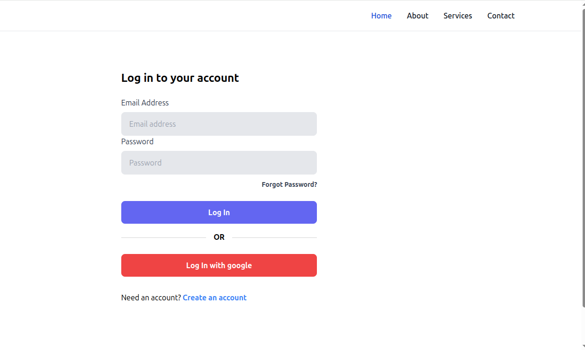
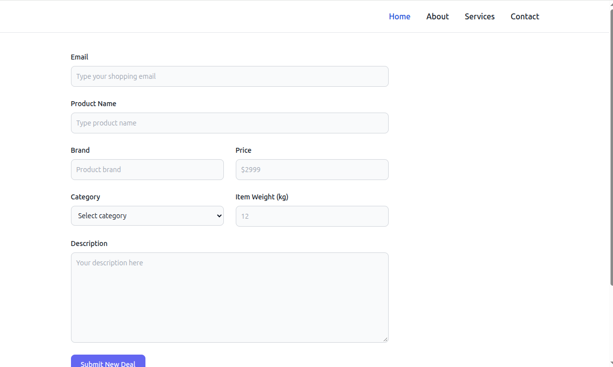

# EmailShopping — Client

React front end for **EmailShopping**, a marketplace where buyers and sellers register,
sign in (email/password or Google), and manage order inquiries delivered by email.

Written by hand (no AI assistance). Companion API: `emailshoppingserver`.

## Features

- Registration and sign-in flows for buyers and sellers
- Google OAuth sign-in
- Order inquiry forms wired to the API
- Responsive Tailwind layout with client-side routing

## Screenshots





## Stack

| Layer | Technology |
|---|---|
| Framework | React 18 |
| Build | Vite |
| Styling | Tailwind CSS 3 |
| Routing | React Router |
| HTTP | Axios |

## Project layout

```
src/
  App.jsx
  main.jsx
  pages/        # route-level screens (auth, registration, ordering)
  components/   # shared UI components
public/
```

## Getting started

```bash
npm install
npm run dev      # http://localhost:5173
```

The dev server expects the API at `http://localhost:5000`
(see `emailshoppingserver`). CORS on the server is scoped to `http://localhost:5173`.

## Environment

Optional `.env` (Vite-style `VITE_*` variables) for API URLs or Google client IDs.
Never commit real credentials.

## Related

- API: `emailshoppingserver`
